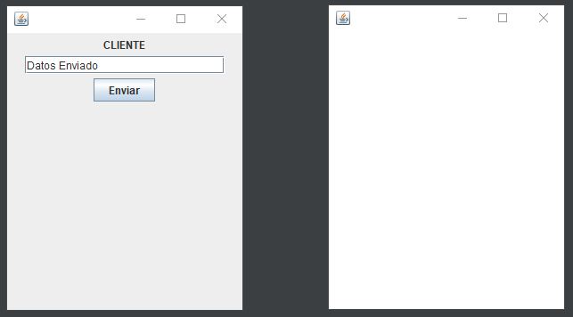
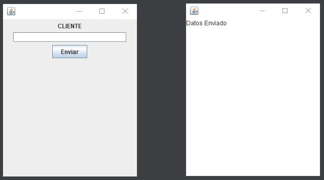

# Ejemplo sencillo de Sockets

Informacion:

* Lenguaje: Java (1.8)
* IDE: Netbeans 8.2
* Autor: Ronald Berduo
* Repositorio: https://github.com/NeftXx/ejemplo-sencillo-sockets-java

## Screenshots

Enviar datos:

Recibir datos:

